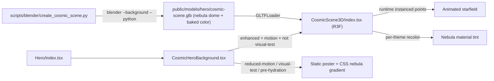

# Cosmic 3D Hero Background

Recreate the cosmic hero background in Blender as a 3D interactive scene, replacing the `cosmos.mp4` video. We mirror the proven engineer pipeline exactly: a Blender Python script bakes static art into a GLB with named materials, and a React Three Fiber component loads it, recolors it per theme, and adds runtime-animated particles. Start minimal (nebula + stars), then grow.

## Architecture (mirrors the engineer theme)

The current engineer reference is [EngineerCircuit3D/index.tsx](src/components/sections/Hero/EngineerCircuit3D/index.tsx) (GLB load + recolor + `InstancedMesh` particle animation + fixed camera rig with pointer parallax) and its lazy wrapper [EngineerHeroBackground.tsx](src/components/sections/Hero/EngineerHeroBackground.tsx). The Blender reference is [create_circuit_board.py](scripts/blender/create_circuit_board.py).

## Key constraints already verified

- `three@0.185` + `@react-three/fiber@9` are already deps (shared vendor chunk) — no new dependencies, so bundle budget impact is the new component code + a small GLB only.
- Blender 5.1.2 is installed; models are generated manually (no npm script today).
- glTF cannot carry Blender procedural shader graphs, so the nebula art must be **baked to a texture (or vertex colors)** and exported embedded in the GLB. The web layer then tints the named material per dark/light cosmic palette.
- Visual-test and reduced-motion paths must NOT mount the canvas (deterministic snapshots), exactly like the engineer `isVisualTest`/`reducedMotion` gating in [EngineerHeroBackground.tsx](src/components/sections/Hero/EngineerHeroBackground.tsx).

## Phase 1 — Minimal slice (nebula dome + starfield)

1. New Blender script `scripts/blender/create_cosmic_scene.py` exports `public/models/hero/cosmic-scene.glb`:
   - One large inward-facing UV sphere (flipped normals) as the nebula/sky dome, material named `Nebula`.
   - Author a procedural nebula (noise/voronoi → color ramp in the cosmic palette: `#0b0014` base, `#c77dff`/`#f72585`/`#4cc9f0` accents), then **bake it to an emissive texture** packed into the GLB (so the look survives glTF export). Keep it small (e.g. 1k texture).
   - Reuse the script scaffolding (`clear_scene`, `make_material`, `export_scene.gltf` with `export_yup=True`, `export_materials="EXPORT"`) from the engineer script.
   - Also render a single still to `public/images/hero/cosmic/cosmos-poster.webp` for the fallback poster.
2. New `src/components/sections/Hero/CosmicScene3D/index.tsx` (R3F), structured like `EngineerCircuit3D`:
   - `<Canvas alpha dpr={[1,1.75]} frameloop={isActive && motion ? 'always' : 'demand'}>`.
   - Load `cosmic-scene.glb`; on load, tint the `Nebula` material per `mode` (dark vs light cosmic).
   - Starfield as a runtime `InstancedMesh` of tiny additive points (toneMapped off, `AdditiveBlending`, `depthWrite=false`) with a slow twinkle/drift in `useFrame` — the cosmic analog of the engineer `DataFlow` packets. Count modest (~1000) and reduced when `calmMotion`.
   - Fixed `CameraRig` with gentle pointer parallax (copy the `BoardScene` `useFrame` lerp pattern).
   - Lights: soft ambient + faint colored rims.
3. New `CosmicScene3D/CosmicScene3D.css` mirroring [EngineerCircuit3D.css](src/components/sections/Hero/EngineerCircuit3D/EngineerCircuit3D.css) (`.cosmic-scene3d-stage`/`-canvas`, hide on `prefers-reduced-motion`).
4. New `src/components/sections/Hero/CosmicHeroBackground.tsx` mirroring [EngineerHeroBackground.tsx](src/components/sections/Hero/EngineerHeroBackground.tsx): lazy-load `CosmicScene3D`; show it only when `shouldLoadScene && !isVisualTest && !reducedMotion`; otherwise render `` (now backed by the rendered poster) over the CSS nebula gradient.
5. Rewire [Hero/index.tsx](src/components/sections/Hero/index.tsx): replace the inline `CosmicHeroBackground`/`ActiveCosmicHeroBackground` (the ~370-line video-playback machinery) with the new wrapper, passing `isActive={isHeroInView}`, `reducedMotion`, `isVisualTest`, `shouldLoadScene={shouldEnhanceHero}`, `calmMotion`, `mode={resolvedMode}`. Drop the cosmic video constants/refs.
6. Trim [Hero.cosmic.css](src/components/sections/Hero/Hero.cosmic.css): remove `.hero-cosmic-video` and `data-cosmic-video-ready` rules; keep the radial-gradient nebula `.hero-background` (instant paint + base layer under the alpha canvas) and `.hero-cosmic-still` (now the poster). Leave the astronaut/asteroid/comet foreground (in `.hero-content`) untouched for now.

## Phase 2+ — Incremental detail (later, not in the minimal slice)

- Add a Blender-modeled celestial centerpiece (planet/asteroid) with named materials, slow rotation.
- Move the astronaut + asteroid + comet foreground from CSS into the 3D scene.
- Nebula parallax layers / depth fog; shooting stars as additive streaks.
- Delete `public/video/cosmos.mp4` (715 KB) once the video path is fully retired.

## Validation

- `npm run type-check`, `npm run lint:ci`, `npm test` (update [Hero/index.test.tsx](src/components/sections/Hero/index.test.tsx) — the cosmic background no longer renders a `<video>`; assert poster/canvas-gated structure instead).
- Regenerate visual snapshots via Docker (`bash scripts/run-visual-linux.sh --update-snapshots=all`) since the cosmic hero markup/visual changes — the visual-test path stays on the static poster so baselines remain deterministic.
- Confirm Lighthouse budgets still pass (no new vendor weight; new GLB + component only).

## Notes / decisions

- No installed "blender skill" or Context7/Blender MCP exists in this environment; we follow the project's existing Python-Blender-to-GLB pattern, which is functionally the same pipeline.
- Per your choices: minimal scene = starfield + nebula only; the video is fully replaced with the 3D scene plus a Blender-rendered static poster for the fallback path.
