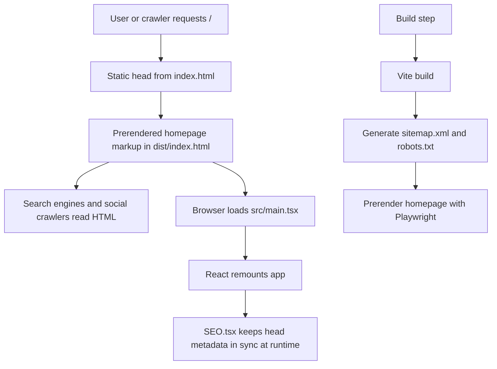

# SEO Architecture Guide

This document explains how SEO works in this app today, why each piece exists, where it lives, and how to maintain it without creating drift between files.

## Current SEO Model

This portfolio is not a traditional server-rendered app. It is a React single-page app that now uses a layered SEO approach:

1. `index.html` ships crawler-critical metadata in the raw HTML response.
2. `npm run build` prerenders the homepage into `dist/index.html` so crawlers also see real page content, not just an empty root node.
3. `src/components/SEO.tsx` keeps browser metadata correct after React mounts and during any future client-side route changes.
4. `plugins/vite-plugin-sitemap.ts` generates `sitemap.xml` and keeps `robots.txt` pointing at it.
5. tests protect the important SEO contracts from accidental regressions.

That combination is deliberate. No single SEO technique is enough for a modern client-rendered site:

- Static tags are best for first-response crawlers and social scrapers.
- Runtime tags are best for SPA navigation and browser state.
- Prerendered body content is best for crawlers that are weak at JavaScript rendering.
- Sitemap and robots help discovery and crawl behavior.
- Structured data helps search engines understand the site as an entity, not just a page of text.

## High-Level Flow



## Source Of Truth

| Concern                         | Files                                                                             | Why it exists                                                                                             |
| ------------------------------- | --------------------------------------------------------------------------------- | --------------------------------------------------------------------------------------------------------- |
| Shared SEO constants            | `src/config/seo.ts`, `src/content/site.ts`                                        | Central place for the brand name, canonical origin, default description, OG defaults, and robots defaults |
| First-response crawler metadata | `index.html`                                                                      | Search crawlers and link preview bots can read this before JavaScript runs                                |
| Runtime metadata                | `src/components/SEO.tsx`                                                          | Keeps the browser tab, canonical, OG, and robots state correct after React mounts                         |
| Structured data                 | `index.html`                                                                      | JSON-LD is most reliable when shipped in the initial HTML                                                 |
| Sitemap and robots              | `plugins/vite-plugin-sitemap.ts`, `public/robots.txt`, `public/sitemap.xml`       | Helps engines discover URLs and understand crawl policy                                                   |
| Prerendered content             | `scripts/prerender.ts`, `src/main.tsx`, `package.json`                            | Ensures the homepage body is visible in HTML without requiring full SSR                                   |
| Regression tests                | `src/static-seo.test.ts`, `src/config/seo.test.ts`, `src/components/SEO.test.tsx` | Prevents accidental metadata drift or broken defaults                                                     |

## What Search Engines Actually See

For the homepage, the important crawler path is:

1. the raw HTML response already contains the title, description, canonical, robots, `hreflang`, Open Graph tags, Twitter tags, JSON-LD, favicon links, and `noscript` fallback.
2. the production build then replaces the empty root with prerendered homepage markup, so the HTML also contains visible content.
3. after the browser boots React, the app remounts and `SEO.tsx` keeps the metadata aligned with the shared config.

This matters because not all bots behave the same way:

- Google can render JavaScript, but it still benefits from correct first-response HTML and prerendered content.
- Bing also understands the same HTML standards and benefits from the same signals.
- Social scrapers often do not execute app JavaScript at all, so they depend on the static tags in `index.html`.

## Why We Have Each SEO Signal

### Critical Signals

| Signal                     | Where                                         | Why we need it                                                                    |
| -------------------------- | --------------------------------------------- | --------------------------------------------------------------------------------- |
| `<title>`                  | `index.html`, `src/components/SEO.tsx`        | Primary page label for search results, browser tabs, bookmarks, and previews      |
| `meta[name="description"]` | `index.html`, `src/components/SEO.tsx`        | Summary snippet candidate for search results and link previews                    |
| `link[rel="canonical"]`    | `index.html`, `src/components/SEO.tsx`        | Prevents duplicate-URL ambiguity and tells engines which URL is authoritative     |
| `meta[name="robots"]`      | `index.html`, `src/components/SEO.tsx`        | Controls whether the page should be indexed and how rich a snippet may be         |
| `sitemap.xml`              | generated by `plugins/vite-plugin-sitemap.ts` | Helps crawlers discover URLs and revisit them efficiently                         |
| JSON-LD structured data    | `index.html`                                  | Gives search engines explicit entity relationships for the person, site, and page |
| Prerendered body content   | `scripts/prerender.ts`                        | Ensures the homepage content is visible without requiring JavaScript execution    |

### Important Secondary Signals

| Signal                                    | Where                                                  | Why we keep it                                                                      |
| ----------------------------------------- | ------------------------------------------------------ | ----------------------------------------------------------------------------------- |
| Open Graph tags                           | `index.html`, `src/components/SEO.tsx`                 | Power rich previews in LinkedIn, Facebook, Discord, Slack, and other unfurlers      |
| Twitter card tags                         | `index.html`, `src/components/SEO.tsx`                 | Improve previews on X and any tool that honors Twitter metadata                     |
| `og:site_name` and consistent site naming | `index.html`, `src/config/seo.ts`, `src/pwa-config.ts` | Prevent brand drift across search, social, and installed surfaces                   |
| `lastmod` in sitemap                      | generated by `plugins/vite-plugin-sitemap.ts`          | Gives engines a trustworthy freshness signal when it reflects a real content update |
| `sameAs` on `Person`                      | JSON-LD in `index.html`                                | Helps search engines connect the site owner to their public identity profiles       |

### Supporting Signals

| Signal                                          | Where                                  | Why we keep it                                                                                                   |
| ----------------------------------------------- | -------------------------------------- | ---------------------------------------------------------------------------------------------------------------- |
| `hreflang="en-US"` and `x-default`              | `index.html`                           | Makes the default locale explicit and gives us a clean base if localized versions are added later                |
| `rel="me"` links                                | `index.html`                           | Extra identity linking between the site and public profiles; not a major ranking factor, but low-risk and useful |
| `meta[name="keywords"]`                         | `index.html`, `src/components/SEO.tsx` | Modern engines largely ignore this for ranking, but it is harmless metadata and currently kept for completeness  |
| `meta[name="application-name"]` and favicon set | `index.html`, `src/pwa-config.ts`      | Not a ranking signal, but helps search/browser surfaces present the site consistently                            |
| `noscript` fallback                             | `index.html`                           | Last-resort readable content if JavaScript fails or a crawler is extremely limited                               |

## Static Head In `index.html`

`index.html` is the crawler-facing contract for the homepage. It currently contains:

- the canonical production URL: `https://jpengineering.dev/`
- the site name: `JP Engineering`
- the core description used across the app
- robots directives with rich-snippet allowances
- `hreflang` links for `en-US` and `x-default`
- identity links via `rel="me"`
- Open Graph and Twitter image metadata
- JSON-LD for `Person`, `WebSite`, and `WebPage`
- a `noscript` fallback block

This file exists because the initial HTML matters. If the static head and runtime head disagree, search engines have to choose which version to trust. That is exactly the kind of ambiguity we want to avoid.

### Why Static Metadata Still Matters In A React App

Even though React updates the page after load, static metadata still does the heavy lifting for:

- crawlers that do not execute JavaScript well
- social media scrapers
- first-wave indexing before rendering
- resilience when client JavaScript fails

For this app, `index.html` should always be treated as the authoritative homepage metadata.

## Runtime SEO In `src/components/SEO.tsx`

`src/components/SEO.tsx` uses `react-helmet-async` to manage metadata after React mounts.

That runtime layer exists for three reasons:

1. browser tab titles should still be correct once the app is live
2. future client-side routes may need unique titles, descriptions, canonicals, or `noindex`
3. metadata should stay consistent even when content changes after load

### What The Runtime Layer Does

- computes the browser tab title
- computes the SEO title with the `Page | Site` format
- resolves relative OG image paths to absolute URLs
- applies the canonical URL
- applies robots rules
- writes Open Graph and Twitter metadata

### Why Static And Runtime Tags Both Exist

They solve different problems:

- static tags are for the initial response
- runtime tags are for the live SPA after mount

The rule is simple: for the homepage, both layers must describe the same page in the same way.

If you change the site name, description, canonical URL, or default image, update:

- `index.html`
- `src/content/site.ts`
- `src/config/seo.ts`
- any affected tests

## Shared SEO Config In `src/config/seo.ts`

`src/config/seo.ts` is the shared metadata config used by the runtime SEO layer and the tests. It defines:

- `SITE_NAME = 'JP Engineering'`
- `SITE_ALTERNATE_NAME = 'JPEngineering'`
- `SITE_ORIGIN = 'https://jpengineering.dev'`
- `SITE_URL = 'https://jpengineering.dev/'`
- `DEFAULT_OG_IMAGE`
- `DEFAULT_OG_IMAGE_ALT`
- `DEFAULT_ROBOTS_CONTENT`

This file exists to keep the runtime layer consistent and to avoid magic strings being duplicated across the React codebase.

### Why The Site Name Was Standardized

The site now consistently uses `JP Engineering` instead of `JP - Engineering`.

That matters because search engines and browsers pick up the site name from multiple places:

- the page title
- `og:site_name`
- `application-name`
- `WebSite` structured data
- the PWA manifest

Using one form everywhere reduces brand drift and gives search engines a clearer site-name signal. The `alternateName` field preserves `JPEngineering` as a secondary recognized form.

## Structured Data In `index.html`

The app ships JSON-LD with three entities:

### `Person`

Represents Justin Paoletta as the subject and publisher of the site.

Why we include it:

- clarifies who the site is about
- connects the site to GitHub and LinkedIn with `sameAs`
- gives engines machine-readable context for skills and role

### `WebSite`

Represents the site as a whole.

Why we include it:

- helps with site-name understanding
- gives the site a stable identity separate from an individual page
- provides `alternateName` for the no-hyphen brand form

### `WebPage`

Represents the current homepage.

Why we include it:

- links the page back to the site and the person
- tells engines what the page is about
- identifies the primary page image

### Why JSON-LD Lives In Static HTML

Structured data is most reliable when it is present in the first HTML response. It does not depend on React mounting, and testing it becomes much simpler because the page contract is visible directly in `index.html`.

## Robots Meta And `robots.txt`

These two pieces are related, but they are not the same thing.

### `meta[name="robots"]`

Current homepage value:

```txt
index, follow, max-image-preview:large, max-snippet:-1, max-video-preview:-1
```

Why we use it:

- `index, follow` allows the page to be indexed and its links crawled
- the `max-*` directives allow large image previews and unrestricted text/video snippets where engines support them

This is page-level behavior. It belongs in the document head because it describes how a specific page should be handled.

### `robots.txt`

Current behavior:

- allows all crawlers
- advertises the sitemap location

This is crawl-level behavior. It tells bots where they may go, but it does not replace page-level metadata.

Important rule:

- do not block a page in `robots.txt` if you expect search engines to read that page's canonical or robots meta tags, because blocked pages may not be fetched deeply enough to see them

## Sitemap Generation

The sitemap is generated by `plugins/vite-plugin-sitemap.ts`.

### What It Does

- reads the base URL from `VITE_SITE_URL` or related env vars
- defines indexable routes in a local `routes` array
- writes `dist/sitemap.xml` for production
- writes `public/sitemap.xml` for local/dev visibility
- updates `robots.txt` so it always points at the correct sitemap URL

### Why `lastmod` Uses Git Or File Timestamps

The sitemap no longer uses the build date as `lastmod`.

That change matters because `lastmod` is only useful when it reflects a real page change. If every deploy says a page changed even when the content did not, search engines learn to distrust the field.

Current logic:

1. try `git log -1 --format=%cs -- <contentPaths>`
2. if git history is unavailable, inspect the latest filesystem modification time
3. if neither works, fall back to today's date

That is a pragmatic compromise between accuracy and operational simplicity.

## Prerendering

The most important recent SEO improvement is prerendering the homepage.

### Why We Added It

Before prerendering, the raw body was basically:

```html
<div id="root"></div>
```

That meant crawlers had to execute JavaScript to see the actual page content. Some can do that. Some do it slowly. Some do it poorly. Some social tools do not do it at all.

Prerendering fixes that by making the built homepage HTML contain real content before the browser executes any JavaScript.

### How It Works

`npm run build` now does this:

1. type-check
2. run the contrast check
3. build the app with Vite
4. run `tsx scripts/prerender.ts`

The prerender script:

- starts a tiny local HTTP server over `dist`
- opens the built site in headless Chromium
- waits for the homepage content to render
- serializes `document.documentElement.outerHTML`
- writes the result back to `dist/index.html`

### Why We Remount Instead Of Hydrate

`src/main.tsx` intentionally clears any prerendered children inside `#root` and then calls `createRoot(...).render(...)`.

We do that because this is not true React SSR output. It is browser-serialized DOM captured after the app runs. Hydrating that markup as if it were byte-for-byte server-rendered React markup can produce hydration mismatch errors.

The tradeoff is acceptable for this site:

- crawlers still get real HTML content
- users still get the full interactive app
- React avoids fragile hydration errors

If the site grows into many indexable routes, a true SSR or SSG framework would become the cleaner long-term option.

## Why The `noscript` Fallback Still Exists

Prerendering is now the primary way crawlers see body content, but the `noscript` block is still useful as a last fallback.

It helps when:

- JavaScript fails to load
- a browser has scripting disabled
- a crawler is extremely limited

It is intentionally simple and should stay simple.

## Validation And Regression Coverage

### Automated Tests

These tests protect the important SEO contracts:

- `src/static-seo.test.ts`
  - verifies the static HTML contract in `index.html`
  - checks canonical, robots, `hreflang`, `rel="me"`, and structured data
- `src/config/seo.test.ts`
  - verifies the shared SEO constants and helper behavior
- `src/components/SEO.test.tsx`
  - verifies runtime `Helmet` output such as canonical handling, robots content, and OG/Twitter tags

Useful commands:

```bash
npx vitest run src/static-seo.test.ts src/config/seo.test.ts src/components/SEO.test.tsx
npm run build
```

### Manual Validation

After a production deploy, validate the live homepage with:

- Google Search Console URL Inspection
- Bing Webmaster Tools URL Inspection
- Google's Rich Results / structured data validation tools
- a quick `curl https://jpengineering.dev/` spot-check

For local checks, remember that `/api/*` routes may 404 outside Vercel. That is expected in a plain static preview and does not mean SEO is broken.

## Maintenance Rules

When changing SEO-related content, use this checklist.

### If You Change The Brand Name Or Description

Update all of:

- `index.html`
- `src/content/site.ts`
- `src/config/seo.ts`
- `src/pwa-config.ts`
- tests that assert those values

### If You Change The Production Domain

Update all of:

- hardcoded absolute URLs in `index.html`
- `SITE_ORIGIN` and `SITE_URL` in `src/config/seo.ts`
- `VITE_SITE_URL` in deployment config so sitemap generation stays correct

### If You Add A New Indexable Route

Do all of:

1. render `<SEO />` with a unique title, description, and canonical for that route
2. add the route to `plugins/vite-plugin-sitemap.ts`
3. decide whether the route should be prerendered too
4. add or update tests for the new route behavior

### If You Add Alternate Languages

Do all of:

1. add real localized URLs
2. expand `hreflang` links
3. update canonical behavior per locale
4. extend sitemap coverage to those URLs

## What Matters Most If We Need To Simplify

If we ever need to reduce complexity, keep these first:

1. correct title, description, canonical, and robots meta
2. prerendered homepage content
3. accurate sitemap and robots.txt
4. JSON-LD for the site and person

These are the highest-value signals for this app.

The lower-priority items are:

- `meta keywords`
- `rel="me"`
- single-locale `hreflang`
- extra presentation metadata

Those are useful but not the foundation.

## External References

These are the standards and platform docs this setup is based on:

- Google Search Central: [JavaScript SEO basics](https://developers.google.com/search/docs/crawling-indexing/javascript/javascript-seo-basics)
- Google Search Central: [Build and submit a sitemap](https://developers.google.com/search/docs/crawling-indexing/sitemaps/build-sitemap)
- Google Search Central: [Robots meta tag, data-nosnippet, and X-Robots-Tag](https://developers.google.com/search/docs/crawling-indexing/robots-meta-tag)
- Google Search Central: [Site names in Google Search](https://developers.google.com/search/docs/appearance/site-names)
- Google Search Central: [How to specify a canonical URL](https://developers.google.com/search/docs/crawling-indexing/consolidate-duplicate-urls)
- Schema.org: [WebSite](https://schema.org/WebSite), [WebPage](https://schema.org/WebPage), [Person](https://schema.org/Person)
- Sitemaps.org: [XML sitemap protocol](https://www.sitemaps.org/protocol.html)

## Summary

The SEO strategy in this app is intentionally layered:

- static metadata for the first response
- runtime metadata for the live SPA
- prerendered content for crawler-visible body text
- structured data for entity understanding
- sitemap and robots for discovery and crawl control
- tests to keep all of it from drifting

That is why the app currently has more than just a single `SEO.tsx` component. Each piece solves a different failure mode, and together they make a client-rendered portfolio behave much more like a search-friendly static site.
